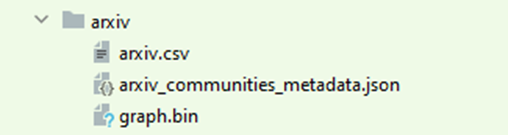
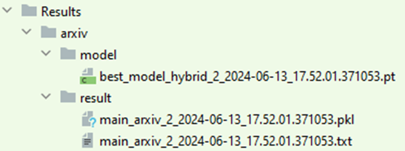

**GPU Accelerator Module for GNN Training**


**Requirements**

- Python 3.7 or higher
- PyTorch 1.9 or higher

**Files**

buffer_queues.py file contains queueing pipeline for buffering batch

GCN.py file contains our optimized model with GPU accelerator engine for GCN model

GraphSAGE.py file contains our optimized model with GPU accelerator engine for GraphSAGE model

FastGCN.py file contains our optimized model with GPU accelerator engine for FastGCN model

FastGCNFlat.py file contains our optimized model with GPU accelerator engine for FastGCNFlat model

FastGCNWrs.py file contains our optimized model with GPU accelerator engine for FastGCNWrs model

FastGCNFlatWrs.py file contains our optimized model with GPU accelerator engine for FastGCNFlatWrs model

Ladies.py file contains our optimized model with GPU accelerator engine for Ladies model

LadiesFlat.py file contains our optimized model with GPU accelerator engine for LadiesFlat model

LadiesWrs.py file contains our optimized model with GPU accelerator engine for LadiesWrs model

LadiesFlatWrs.py file contains our optimized model with GPU accelerator engine for LadiesFlatWrs model

**How to run:**

Set up the environment by installing Python and required libraries

Run ```Python {file_name}.py``` to run the model with our GPU accelerator engine 

##### Configurable parameters for Community-Oriented Generation (COG)
Following are the user-defined configurable parameters for COG generation:
```
parser = argparse.ArgumentParser(description='Generate COG: cora/pubmed/citeseer/arxiv/reddit/products Datasets')
parser.add_argument('--dataset', type=str, default='arxiv',
                    help='Dataset name: cora/pubmed/citeseer/arxiv/reddit/products')
parser.add_argument('--output_path_dataset', type=str, default='dataset/relabel_dataset/',
                    help='Dataset name: cora/pubmed/citeseer/arxiv/reddit/products')
parser.add_argument('--batch_size', type=int, default=512,
                    help='size of output node in a batch')

args = parser.parse_args()

# initiate cog generation
run_cog(args)
```
##### Run the code
From the main directory excute the following command:
```
python main_cog.py
```
##### Configurable parameters for GNN training
Following are the user-defined configurable parameters for COG generation
```
argparser = argparse.ArgumentParser()
argparser.add_argument('--dataset', type=str, default='arxiv')
argparser.add_argument('--path', type=str, default='dataset/relabel_dataset/',
                       help='Dataset path: provide path to a relable dataset')
argparser.add_argument('--batch_size', type=int, help='size of output node in a batch', default=512)
argparser.add_argument('--n_samp', type=int, default=512, help='Number of sampled nodes per node')
argparser.add_argument('--n-epochs', type=int, default=3)
argparser.add_argument('--n-hidden', type=int, default=512)
argparser.add_argument('--n-layers', type=int, default=2)
argparser.add_argument('--samp_growth_rate', type = float, default = 2,
                       help='Growth rate for node-wise sampling')
argparser.add_argument('--n_trial', type=int, default=5,
                       help='Number of times to repeat experiments')
argparser.add_argument('--lr', type=float, default=0.001)
argparser.add_argument('--dropout', type=float, default=0.2)
argparser.add_argument('--n-stops', type=int, default=200,
                       help='Stop after number of batches that f1 dont increase')
argparser.add_argument('--batch-num', type=int, default= 10,
                       help='Maximum Batch Number')
argparser.add_argument('--o_iters', type=int, default=2,
                    help='Number of iteration to run on a batch')
argparser.add_argument('--record-f1', action='store_false',
                       help='whether record the f1 score')
argparser.add_argument('--samp_type', type=str, default='hybrid', help='hybrid')
argparser.add_argument('--gpu', type=int, default=0, help="GPU device ID. Use -1 for CPU training")
args = argparser.parse_args()
# initiate training
run_train(args)
```
##### Run the code
From the main directory excute the following command:
```
python CommGNN.py
```
#### Results and Output files
All the files related to COG will be stored on a given path under the [graph] folder. It will contain the following three files. For example, as shown below:



After the training, the final model and results will be stored on the path, “Results/[graph]”. There will be two folders, i.e., model and results, containing the final model and final results respectively. For example, as shown below:




<!-- ACKNOWLEDGMENTS -->
**Acknowledgments**
* [Data and Knowlege Engineering Lab (DKE)](http://dke.khu.ac.kr/)
<p align="right">(<a href="#top">back to top</a>)</p>
